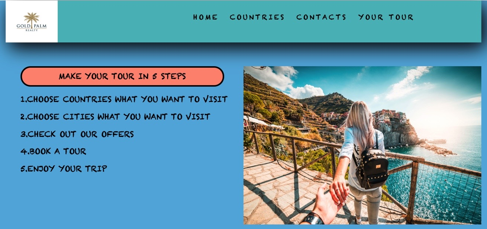
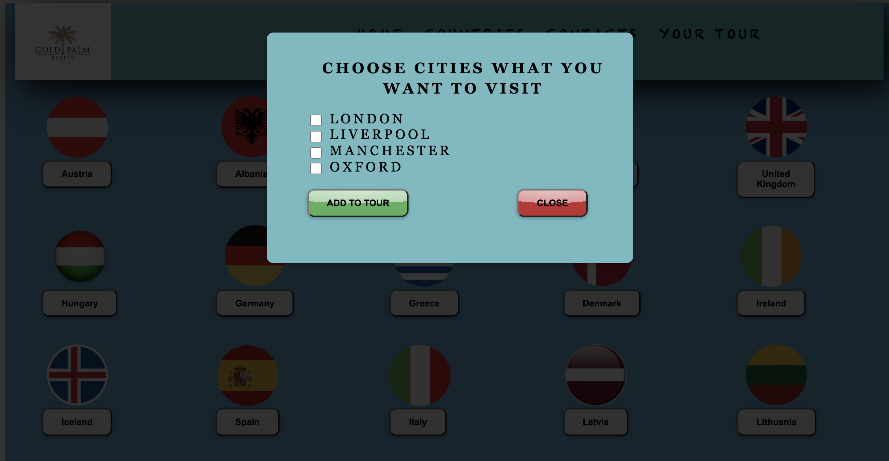

                             
 # Tourism website 'Gold Palm'
Hi there. Welcome to my project - tourism website 'Gold Palm'.
This project was bootstrapped with [Create React App](https://github.com/facebook/create-react-app).

## Review of the website

This is a multi-page site with pages: home, countries, contacts, your tour. 
The house page contains all the main information about the site. 
On the country page, you can select the countries and cities you want to visit. 
On the contact page there are company phone numbers, e-mail address and a map of how to get to the travel agency.
 Your tour represents the tour you have chosen.
 
## Installation
npm i --save palm

### ` npm start`
In the project directory, you can run:
Runs the app in the development mode.<br />
Open [http://localhost:3000](http://localhost:3000) to view it in the browser.

### Technologies in the project
Page markup was done  using the HTML   
Page styling was done using the CSS   
Application was written in the language JS   
React ana Redax  were connected to the application

### Usage
With the help of React and Redux  was   implement functionality.
When choosing a city, they were taken from the store and drawn on another page.



### Interaction with the React-Redux library
// combineReducers
```
import {combineReducers} from 'redux';
import cities from "./cities";

export default combineReducers({
    cities
});
```
// YourTour

```import React, {Component} from "react";
   import {connect} from 'react-redux'
   import './YouTour.css'
   
   class YourTour extends Component {
   
       render() {
           return (
               <div className={'wrapper_your_tour'}>
               <div className={'scroll'}>
                   <div className={'heading_your_tour'}>YOUR SELECTED TOUR</div>
                   {this.props.cities.map(el => {
                       return <h1> {el}</h1>
                   })}
               </div>
               </div>
           )
       }
   }
   
   const mapStateToProps = store => ({
       cities: store.cities.cities
   })
   
   export default connect(
       mapStateToProps,
       null
   )(YourTour); ```
